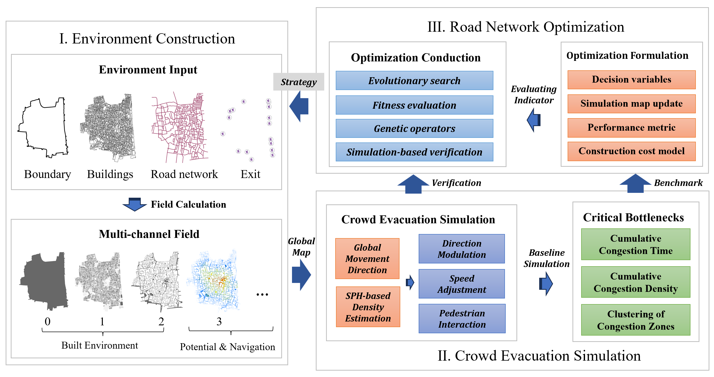

# Road-Network Optimization for Disaster Evacuation

Reproducibility materials for the paper:

> **A Novel Simulation-based Approach to Optimizing Road Networks for Disaster Evacuation in Dense Urban Informal Settlements**

**Authors:** Chun Song, Zhijie Zhou, and Rui Cao (corresponding author)<br>
**Affiliation:** Thrust of Urban Governance and Design, Society Hub, The Hong Kong University of Science and Technology (Guangzhou), Guangzhou, China

**Maintainer:** [Chun Song](https://chun-song.com) · [GitHub: Shyr0796](https://github.com/Shyr0796)<br>
**Repository:** [rui-research/roadnet-evac-opt](https://github.com/rui-research/roadnet-evac-opt)



## What is included

This repository is synchronized to the active `\includegraphics` entries in
`manuscript/CEUS.tex`:

- `manuscript/`: the exact paper source, bibliography, PDF, and exactly 21 cited figure files;
- `results/`: only the released data needed by the paper-figure pipelines;
- `plotting/`: nine focused pipelines plus one portable path module and one runner;
- `figures/generated/`: exactly 12 data-derived figures regenerated by the runner;
- `generated/`: the tables and intermediate summaries produced during regeneration.

The remaining nine manuscript figures are contextual photographs, method/GIS
diagrams, or simulation snapshots. Their final paper assets are preserved in
`manuscript/fig/`; they are not misrepresented as plots regenerated from tabular
data. The complete one-to-one mapping is in [PLOTTING_INDEX.md](PLOTTING_INDEX.md).

Native C/C++/CUDA simulator source, executables, libraries, build products, and
unrelated revision figures or experiment code are intentionally excluded.

## Reproduce the paper figures

Python 3.10 or newer is recommended.

```bash
git clone https://github.com/rui-research/roadnet-evac-opt.git
cd roadnet-evac-opt
python3 -m venv .venv
source .venv/bin/activate
python3 -m pip install --upgrade pip
python3 -m pip install -r requirements.txt
MPLBACKEND=Agg python3 plotting/run_all.py
```

The command regenerates these 12 active manuscript figures from the released
data, without calling a native simulator:

```text
hist_time_distance.png
paradigm_passage_sim.png
cumulative_time_density.png
ga_7_1.png
Fig4_road_widening_frequency_2m_4m.png
ga_7_2.png
Fig_R2_pareto_front_15d.png
FigR_C1_free_flow_lower_bound.png
Fig_R1_macro_spatial_composite.png
FigR_C5_physical_evacuation_metric_sensitivity.pdf
FigR_C5_physical_optimization_sensitivity.pdf
FigR_C5_nsga2_parameter_sensitivity.pdf
```

Outputs are written to `figures/generated/`; the exact paper assets under
`manuscript/fig/` are never overwritten.

## Experiment boundaries preserved in the release

- Paired village-scale validation: 50,000 agents, seeds 11, 29, 47, 71, and 101.
- Physical/crowd-model sensitivity: 8,000 agents, 13 OFAT settings, three seeds,
  and 24 simulator calls per optimization run.
- NSGA-II parameter sensitivity: 15,000 agents, seven OFAT settings, three seeds,
  and 240 simulator calls per setting and seed.
- The finite-budget 15-segment Pareto figure reports the completed seed-11 run;
  unfinished runs are not included as completed evidence.

These are simulation and controlled sensitivity results. They are not field
validation, proof of global optimality, or a unique real-world widening plan.

## Validate the package

```bash
python3 verify_release.py
sha256sum -c MANIFEST.sha256
```

See [VALIDATION.md](VALIDATION.md) for the recorded checks and
[DATA_INVENTORY.md](DATA_INVENTORY.md) for the released-data scope.

## Citation

Please cite the paper title above. Add the final journal citation and DOI from
the publisher record when available; this repository does not guess them.

---

中文说明：本仓库只保留正式论文实际引用的图片、直接服务于这些图片的绘图代码，以及重绘所需的发布数据。个人主页：[Chun Song](https://chun-song.com)；个人 GitHub：[Shyr0796](https://github.com/Shyr0796)。
